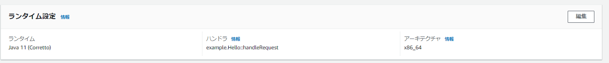
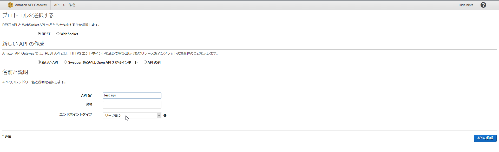
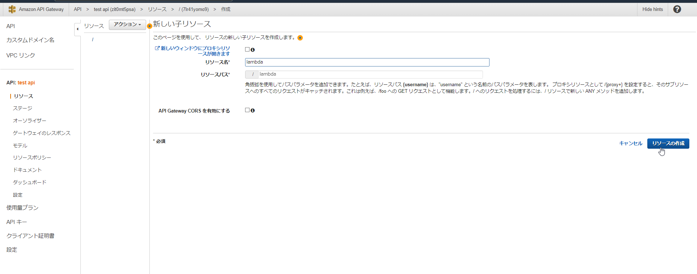

# Lambdaノウハウ

## Lambda においてランタイムに Java を選択した場合のデプロイ手順

### 背景、目的

業務で Lambda+Java の環境での開発を行いましたが、Java での開発は初めて+Lambda も初めての初心者状態からの試行で色々躓きました。  

AWS の各機能についてはだいたいが公式のリファレンスを置いているのでわかる方には不要かと思いますが、自分のように「Java も Lambda も初心者がとりあえず最速で動かしたい」といった場合に、他の方の参考資料や自分の備忘録として残しておこうと思い作成しています。

最低限動作させるところが目的で、細かい設定などは省略しています。

通常、この手の話はネット上ですぐ出てくるのですが、今回の組み合わせで適当なレベル感のものは見当たらず…  

Python や NodeJS はコンソール上で手軽に試行できるようになっているため、Lambda において使用されるランタイムとしてはネット上では Python や NodeJS が主流で、比較的 Java を使用した例は少なく、ネット上の記事を見ても、Java を使用した解説などは少ないようです。  

最終的には API GateWayと接続するLambda 関数の作成について記載していきます。

### 前提条件

- AWS にログインできる
- Lambda の作成ができる権限がある

### 関数の作成～デプロイまでの流れ

1. 関数の作成
2. ローカル環境構築
   1. Java のインストール
   2. Gradle のインストール
   3. Lambda で実行できる構成の構築
   4. ビルド
3. デプロイ

### 1. 関数の作成

- Lambda、関数の作成ボタンから作成画面を開く
  - ランタイムはJava11を選択
  - 「関数の作成」を押下
- 確認

Lambda、関数の作成ボタンから作成画面を開く  
  

ランタイムはJava11を選択  
  

「関数の作成」を押下  


確認


### 2. ローカル環境構築

#### 2-1 Java のインストール

- [OpenJDK_11](https://jdk.java.net/java-se-ri/11)のダウンロード
- インストール
  - 配置・解凍
  - パス設定

[OpenJDK_11](https://jdk.java.net/java-se-ri/11)のダウンロード  
  

#### 2-2 Gradle のインストール

- [Gradle](https://gradle.org/install/)のダウンロード
- インストール
  - 配置・解凍
  - パス設定

[Gradle](https://gradle.org/install/)のダウンロード
  
  

#### 2-3 Lambda で実行できる構成の構築

- Handler設定
  - Lambda としてコードを起動させるためには、HandlerクラスにhandleRequest関数を実装する必要があります。

  ```Java
  /**

  - Lambda ハンドラークラス.
  */
  public class SampleHandler implements RequestHandler<Map<String, Object>, Object> {

    /**

  - Lambda Function メイン関数.
  *
  - @param event         APIGatewayイベント情報
  - @param lambdaContext トリガー発火時に渡されたJSONデータ内情報
  - @return 処理結果
    */
    @Override
    public Object handleRequest(Map<String, Object> event, Context lambdaContext) {
    ..........(処理内容)...........
    }
  }
  ```
  
  - このとき、Lambda 上のハンドラー設定とJavaパッケージの階層を合わせる必要があります。  
    この場合、/sample_project/src/main/javaの下から **/sample/SampleHandler** の **handleRequest** を呼び出すように修正します。  
  - ハンドラー設定
    - 「編集」を押下
    
    - 「ハンドラ」項目の変更
      
    - **sample.SampleHandler::handleRequest** に変更、保存を押下
      
    - 確認
      

- ビルド設定
  - build.gradleファイルにzipファイル圧縮の設定を記載します。

  ```gradle
    task buildZip(type: Zip) {
        from compileJava
        tasks.withType(JavaCompile) {
        options.encoding = 'UTF-8'
        }
        from processResources
        into('lib') {
            from configurations.runtimeClasspath
        }
    }

    .........
    
    build.dependsOn buildZip
  ```

- サンプル
  - サンプルのリポジトリは ../sample_project 以下に配置しています。

#### 2-4 ビルド

- コマンド実行
  - ルートディレクトリで `gradle.build` を実行します。
    
- ファイル確認
  - 下記のファイルが生成されている
  - /sample_project/build/distributions/sample_project.zip

### 3. デプロイ

- ビルドしたzipファイルをアップロードします。
  - 「アップロード元」を押下  
    
  - 「zipまたはjarファイル」を押下  
  
  - 「アップロード」を押下  
  
  - ビルドしたsample_project.zipを選択し、「保存」を押下  
  
  - ビルド後、テストして確認する  
  
  

## API Gatewayとの接続

### API の作成

- API Gatewayから「REST API」を押下  
    
    
- APIの作成が初めての場合はダイアログが表示されるため「OK」を押下
    
- 「新しいAPI」を押下
    
- 「API名」を入力し「APIの作成」を押下
    
- 確認
    

### リソース の作成

- アクションから「リソースの作成」を押下  
  
- 「リソース名」を入力し「リソースの作成」を押下  
  
- 確認  
  

作成したいAPIの構成によっては繰り返しリソースを作成します。

### メソッド の作成

- アクションから「メソッドの作成」を押下  
  
  
- メソッドの種類を選択します。  
  
  
- 「結合タイプ」を「Lambda関数」、「Lambdaプロキシ統合の使用」を有効化します。※  
  
- 「Lambda関数」で先ほどアップロードしたLambda関数を選択します。
  
  
- 権限の付与を許可します。
  
- 確認
  

※このとき、選択する Lambda 関数のレスポンス型は`APIGatewayProxyResponseEvent`に適合する型である必要があります。（Sampleを参照）

### ステージの作成（デプロイ）

- アクションから「APIのデプロイ」を押下  
  
  
- 「デプロイするステージ」を選択（ステージ未作成のため「新しいステージ」を選択）  
  
- 「ステージ名」を入力、「デプロイ」を押下
  
- 確認
  
  
  
